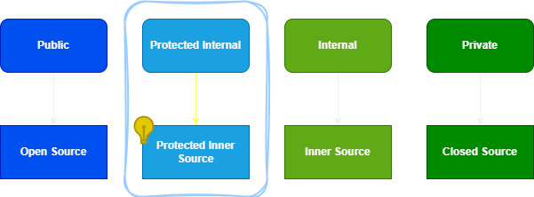
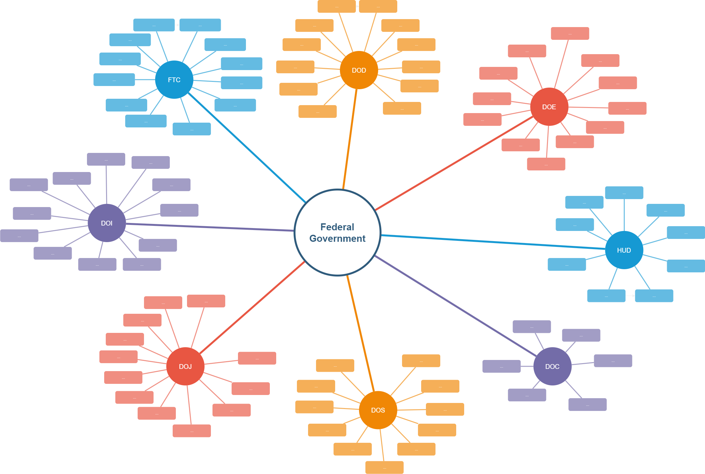

# Open Source - Inner Source - Protected Inner Source

# Protected Inner Source
UPDATE: Based on feedback, I am changing the name of this source code sharing strategy to 'Co Source'. The direct analogy between Protected Internal Class and Protected Inner Source seemed to imply a lack of security in traditional Open Source sharing strategies, which was not my intent. Read more about the naming change in my follow-up article here: [Co Source - Renamed Source Code Sharing Strategy](/2024/07/21/co-source-renaming/)

## Intro
### Inner source
In the digital era, software development is a cornerstone of innovation. Inner Source has gained traction in this domain. It is a strategy that applies Open Source practices within an organization. Unlike Open Source, Inner Source is not public. It remains confined to a single organization. This approach encourages collaborative software development. Teams across the organization can contribute, regardless of departmental boundaries. Inner Source fosters a culture of transparency and shared responsibility. It leads to improved code quality and accelerated innovation. By leveraging Inner Source, companies can harness the collective expertise of their employees. They can do so while protecting proprietary code.

If you'd like to read more about Inner Source, feel free to do so [here on Wikipedia](https://en.wikipedia.org/wiki/Inner_source).

### Access Modifiers
In C#, access modifiers control access to the class and its members. They are essential for encapsulation. Public, protected, internal, and private are the primary modifiers. Each serves a unique purpose. Public classes are accessible from any other class. Protected classes are accessible within their own class and by derived class instances. Internal classes are accessible only within their own assembly. Private classes are restricted to the containing class.

To understand the exact workings of access modifiers in C#, please reference [the Microsoft Learn article here](https://learn.microsoft.com/en-us/dotnet/csharp/programming-guide/classes-and-structs/access-modifiers#summary-table).

## The Analogy: Source Strategies and Access Modifiers
Access modifiers in C# can be compared to source sharing strategies. Internal classes resemble Inner Source, they are accessible within an organization. Consider the following:
* Open Source code is available to *everyone*.
* Inner Source code is available *only to those in one organization*.
* Closed Source code is strictly controlled, *only available to a specific development team*.
* In comparison, Public Classes are *open to everyone*, even from different assemblies (everyone in the world).
* Similarly, Internal Classes are closed to everyone, *except for classes in the same assembly* (a single company).
* Finally, Private classes are closed to everyone, *except for methods in the same class* (a development team/department).

This analogy helps explain how code sharing works in relation to varying levels of accessibility.

## Protected Inner Source
### A Novel Concept
Protected Inner Source, something I have not seen elsewhere so far, is akin to Protected Internal classes. It’s a hybrid access level. It allows sharing among certain trusted organizations. These organizations operate independently yet share a common trust boundary.
* Derived classes from different assemblies. Analogous to separate organizations still *affiliated to the same parent organization*.
* Non-derived classes from different assemblies, unaffiliated organizations have *no access*.

### Specific Applications
While this may not apply to most organizations in the world, there are some specific examples:
* Public sector organizations (Federal, EU, etc.) often share (more) freely than private ones.
* Private organizations with complex legal holdings, still sharing trust between sibling companies.
* Consortiums, in any sector, might need to collaborate on specific source code with similar levels of trust.
* Source code with low proprietary value, for instance, legacy applications out of support. A contracting company might be given access to take over ownership for specific purposes.

*Please note! This is an example of connected government departments, there was no validation done for this blog post to determine their levels of trust and ability to share code.*

### The Benefits
Protected Inner Source offers several benefits:
* It promotes collaboration without compromising security.
* It reduces duplication of effort across organizations.
* It also accelerates innovation and development.
* This approach leverages the strengths of multiple entities.
* It does so while maintaining each entity’s autonomy.
* It provides traceability in modification of complex solutions.

### Considerations for implementation
Implementing Protected Inner Source requires careful planning:
* **Trust and Security**: How will organizations establish and maintain a trusted relationship? What security measures would be necessary to protect shared code from external threats?
* **Governance**: Who decides what gets shared and how contributions are managed? There might need to be a governance model that all parties agree upon.
* **Interoperability**: How will the shared code be designed to ensure it is easily adaptable across different organizations’ systems?
* **Legal and Compliance**: Are there legal or regulatory considerations when sharing code between such entities?

## Conclusion
Protected Inner Source could revolutionize collaborative development for trusted organizations. It combines the openness of Open Source with the control of Inner Source. This model could be particularly beneficial for government organizations in the public sector. It allows them to share resources efficiently and securely.

Especially in a world where ecosystems are becoming more prominent, this might be beneficial. Imagine not having to spend countless hours working on licensing agreements and NDAs for such partnerships. Build upon trusted relationships in source code sharing strategies. Just like we started doing with federated identities in Identity and Access Management years ago!

