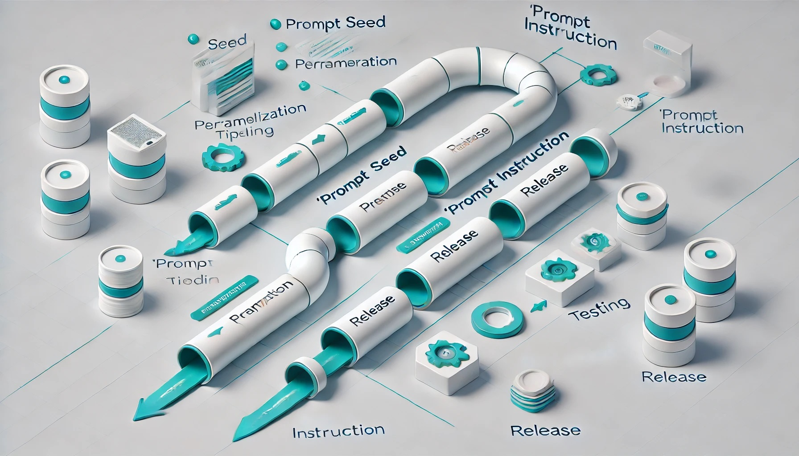

# PEaC Gen AI Usage

# **Prompt Engineering as Code: AI Memory Transfer and Reusable Instructions**

## **Introduction**

In the rapidly evolving field of artificial intelligence, efficiency and consistency are paramount. Borrowing from the successes of methodologies like Infrastructure as Code (IaC) and Documentation as Code (Docs as Code), we can enhance AI interactions by treating prompts and context as code artifacts. This approach introduces two innovative concepts under one banner:

1. **Prompt Seed**: Capturing and transferring AI interaction contexts in code format.
2. **Prompt Instruction**: Storing and managing prompt templates as reusable code components.

By unifying these under the umbrella of **Prompt Engineering as Code (PEaC)**, we can apply best practices from software development to AI prompt management, enabling version control, collaboration, and scalability.

## **1. Prompt Seed**

### **Concept Overview**

**Prompt Seed** involves exporting the AI's current user-specific context into a standardized, code-friendly format (like JSON or Markdown). This "seed" can be imported by another AI model or instance, allowing it to restore the context and continue the interaction seamlessly. In essence, this would be a memory transfer from one instance to the next, without having to rebuild context over time.

### **Benefits**

- **Context Continuity**: Transfer your personalized AI experience across different models or accounts.
- **Version Control**: Use Git repositories to track changes to your AI context over time.
- **Collaboration**: Share context seeds with team members to align AI interactions.
- **Backup and Restore**: Safeguard your AI settings and preferences against data loss.

### **Parameterization**

Just as in IaC, thing like sensitive data, personally identifiable information (PII), and secrets should be parameterized. This involves replacing sensitive parts of the context seed with placeholders (parameters) that can be injected when needed. This can also be used to pass along parameters that change at deployment time, like specifics for different AI models. By doing so:

- The core context template remains reusable and safe to share.
- Sensitive information is only introduced during the interaction or deployment.
- You can use tokenization or environment-based secrets to keep data secure.
- You can modularize the context template to take specific instructions for different models like going from Open AI to Claude for example.
- Versioning can also be used to adapt the context to specific model versions.

### **Implementation**

- **Standardized Format**: Define a schema for the context data (e.g., YAML, JSON).
- **Export/Import Tools**: Develop scripts or use existing tools to serialize and deserialize the AI context.
- **Security Measures**: Encrypt sensitive information and parameterize sensitive data within the context seed.
- **Integration with Version Control**: Store context files in repositories for change tracking and collaboration.

### **Use Case Example**

A user switches from one AI platform to another. By exporting their context seed from the old platform and importing it into the new one, they retain personalized settings, preferences, and interaction history. Sensitive information, such as authentication tokens or private preferences, can be parameterized and safely injected during deployment.

## **2. Prompt Instruction**

### **Concept Overview**

**Prompt Instruction** focuses on creating, storing, and managing AI prompts as code artifacts. By treating prompts like code, users can apply software development practices to improve and reuse them efficiently.

### **Benefits**

- **Reusability**: Develop a library of prompts that can be reused across projects.
- **Consistency**: Ensure uniformity in AI interactions within a team or organization.
- **Collaboration**: Share and improve prompts collaboratively using version control systems.
- **Automation**: Integrate prompts into scripts and workflows for automated AI tasks.
- **Versioning**: Integrating versioning into the prompts will allow tailoring of prompt instructions to specific models, to avoid breaking changes.

### **Parameterization**

Prompts can be parameterized by using placeholders that are filled during execution. This allows for greater flexibility and adaptability:

- **Dynamic Prompts**: Replace key parts of a prompt with parameters that are filled based on user input or deployment context.
- **Pipeline Integration**: Parameters can be injected through automated pipelines, similar to how environment variables are used in software deployment.

### **Implementation**

- **Template Creation**: Write prompts in code files with placeholders for dynamic content.
- **Version Control**: Use Git to manage changes, branches, and merges of prompt templates.
- **Documentation**: Comment and document prompts for clarity and ease of use.
- **Integration Tools**: Develop or use plugins to insert prompts directly into AI interfaces from code repositories. This might be achieved through (YAML) pipelines.

### **Use Case Example**

A team frequently needs to generate PowerPoint presentation outlines. By creating a well-crafted prompt template stored in a repository, any team member can quickly generate outlines by using the template, ensuring efficiency and consistency. Parameterized sections of the prompt can be filled by team members based on specific presentation topics or target audiences.

## **3. Unified Concept: Prompt Engineering as Code (PEaC)**

### **Rationale**

Combining both concepts under **Prompt Engineering as Code** creates a comprehensive framework for managing AI interactions. PEaC emphasizes the importance of treating both the AI's context and the prompts we use as code artifacts that can be versioned, shared, and improved upon.

### **Key Principles**

- **Modularity**: Break down prompts and contexts into reusable components.
- **Standardization**: Use consistent formats and schemas for prompts and context seeds.
- **Collaboration**: Leverage platforms like GitHub or GitLab for sharing and collaborative development.
- **Automation**: Integrate with CI/CD pipelines for automated testing and deployment of prompts.
- **Parameterization**: Securely manage sensitive information through tokenization and parameter injection.

## **4. Applying Best Practices from "as Code" Methodologies**

### **Version Control**

- **Branching Strategies**: Use feature branches for prompt development and merge them after review.
- **Commit Messages**: Write clear messages to document changes in prompts or context seeds.
- **Pull Requests**: Review changes collaboratively to maintain quality.

### **Testing**

- **Automated Testing**: Develop scripts to test prompts with different inputs and validate outputs.
- **Continuous Integration**: Integrate testing into the CI pipeline to catch issues early.
- **Release Stages**: Employ stages to validate prompt code changes in different environments before release them to production agents.

### **Documentation**

- **Inline Comments**: Document the purpose and usage of prompts within the code.
- **README Files**: Provide overviews and instructions in repository README files.
- **Change Logs**: Maintain logs to track significant updates or changes.

### **Security**

- **Access Control**: Restrict repository access to authorized users.
- **Sensitive Data Handling**: Parameterize sensitive information and inject it during execution.
- **Compliance**: Ensure practices comply with data protection regulations (e.g., GDPR).

## **5. Potential Challenges and Solutions**

### **Challenge 1: Model Compatibility**

**Issue**: Different AI models may interpret prompts or context seeds differently.

**Solution**: Establish compatibility layers or adapters for different AI models, or maintain model-specific branches of prompts and contexts. Potentially use parameters to this end as well.

### **Challenge 2: Privacy Concerns**

**Issue**: Storing user contexts may expose personal data.

**Solution**: Implement data anonymization and encryption. Parameterize sensitive information and obtain necessary consents. Storing secrets in code is a well known bad practice.

### **Challenge 3: Community Adoption**

**Issue**: Gaining widespread acceptance for the methodology.

**Solution**: Demonstrate value through case studies, encourage open-source contributions, and provide easy-to-use tools.

## **6. Conclusion**

**Prompt Engineering as Code** represents a significant step forward in managing AI interactions. By applying proven software development practices, we can enhance efficiency, promote collaboration, and ensure consistency in how we interact with AI systems.

Before this concept can be brought to its *peak*, the following steps are still needed:

- **Experimentation**: By exporting AI context and creating prompt templates, and continually evolving their efficacy.
- **Tool Development**: Develop or contribute to tools that facilitate PEaC practices.
- **Community Engagement**: Sharing experiences and improvements with the community to really consolidate the practice in the field of prompt engineering.

As soon as I have a working example of the concept I will upload it to my GitHub as a follow-up to this post!

