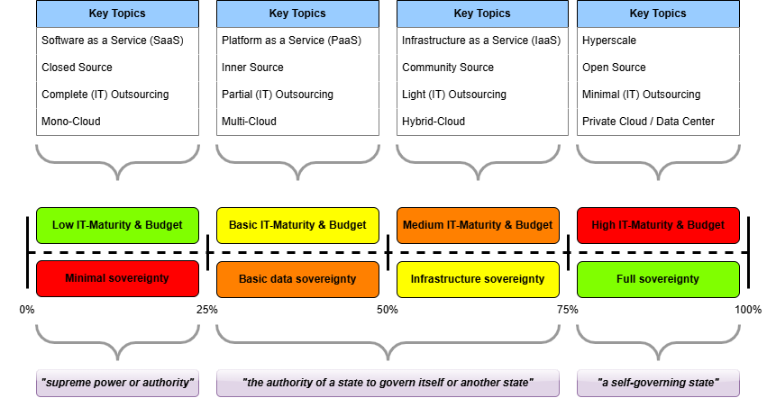

# Sovereignty Scale: A Path to EU Digital Independence

# Introducing the Sovereignty Scale: A Path to EU Digital Independence

In today's digital landscape, the concept of sovereignty has become increasingly important, especially within the European Union (EU). As geopolitical circumstances evolve, there is a growing demand for sovereign cloud and tech solutions that can rival the dominance of Big Tech companies like Amazon, Google, and Microsoft. However, the path to achieving true digital independence is complex and multifaceted. This is where the Sovereignty Scale comes in—a novel concept designed to measure and promote progress towards EU digital sovereignty.

Before we dive in, let's first understand what sovereignty means in the literal sense:
1. "_supreme power or authority_"
2. "_the authority of a state to govern itself or another state_"
3. "_a self-governing state_"

These definitions will help us frame a more structured discussion on the subject.

## Understanding the Sovereignty Scale

The Sovereignty Scale is a framework that rates the sovereignty of an organization's digital systems on a percentage scale from 0% to 100%. This scale helps organizations assess their current level of digital independence, set realistic goals for improvement, and define what needs to be done to meet those goals. Here’s a breakdown of what the percentages mean:

- **0%-25%**: Minimal sovereignty. Organizations in this range are heavily reliant on external providers for their digital infrastructure, software, and services. In this case, another organization is the _supreme power of authority_ over your organization's digital infrastructure.
- **25%-50%**: Basic data sovereignty. These organizations have taken steps to control access to their data, such as using Bring Your Own Key (BYOK) solutions. This is a middle ground where _the organization has some measure of authority to govern itself_.
- **50%-75%**: Infrastructure sovereignty. At this level, organizations have significant control over their data and compute resources, possibly using hybrid or multi-cloud solutions. Still a middle ground, but _the organization has more authority to govern itself_.
- **75%-100%**: Full sovereignty. Organizations in this range have complete control over their software, hardware, and services, often utilizing open source solutions and hosting their own data centers. In line with the literal definition, this is where any organization is _a self-governing entity_.

### Weighting Factors

While I personally deal with software applications and platforms the most in my field, the above criteria are applicable to many situations. It will be complicated to declare a specific sovereignty score for everything in an organization.

I propose evaluating relevant aspects, such as all your IT solutions at a software level, but not the entire supply chain including who owns the upstream cobalt mine for your technology hardware. Once you have subject matter experts in a single field come up with that score, you could always aggregate scores from different levels. For instance, what is our hardware engineering sovereignty versus our software engineering sovereignty?

Different components of an organization's digital system may have different weights in the overall sovereignty score. For example, data sovereignty might be more critical for some organizations than hardware sovereignty. Here are some factors to consider when assigning weights:

- **Data Sovereignty**: Control over data access and storage.
- **Infrastructure Sovereignty**: Control over compute resources and hosting environments.
- **Software Sovereignty**: Use of open source software versus proprietary solutions.
- **Hardware Sovereignty**: Origin and control over hardware components.

The following depiction illustrates how one might conceptually see the scale and the weighting factors:

### Practical Example Scenario

Let's evaluate the sovereignty of the cloud landscape for the fictive company '**Dutch Hotels & Restaurants (DHR)**'. This company has several physical hotels across the Netherlands, each including restaurants. They service many clients, communicate internally with staff and externally with customers, process payment information, and follow stringent rules regarding physical safety and security of hotel guests. Their cloud components include:

| Product                                                        | Purpose                                                                 | Source        | Sovereignty Score |
| -------------------------------------------------------------- | ----------------------------------------------------------------------- | ------------- | ----------------- |
| SharePoint (Online)                                            | Administrative file sharing and storage                                 | Closed Source | 10%               |
| grommunio (self-hosted)                                        | Email server                                                            | Open Source   | 80%               |
| Microsoft Outlook (Desktop client, cloud connections disabled) | Email client app on Windows                                             | Closed Source | 45%               |
| Azure Virtual Machines                                         | Hosting of the public website, reservations system, and grommunio       | Closed Source | 30%               |
| Microsoft Teams                                                | Internal communication                                                  | Closed Source | 10%               |
| PostgreSQL Database Servers (On-premises)                      | Hosting of databases with all customer data behind Azure hosted systems | Open Source   | 90%               |
| Site-to-site VPN                                               | Connectivity between Azure applications and databases on-premises       | Closed Source | 50%               |

For argument's sake, let's evaluate. Averaging it out over those base scores, we get a **45% sovereignty score** for the cloud landscape overall.

All personally identifiable information (PII) and payment card numbers are stored in the on-premises databases. So from the need to _govern_ their customer's data, the 90% sovereignty score for databases hosted on-premises is great. The total 45% sovereignty score in that sense might be 'just what DHR needs'. Similarly, the email server solution ensures all communications with the client are strictly controlled by DHR themselves, even though the servers are located on Azure Virtual Machines.

However, if this were a major federal government organization, they might need a minimum 50% sovereign score for their purposes. If it concerns a national security organization, then perhaps they might need a minimum 75% or higher. It all depends on the context, every organization must establish their own guidelines based on their strategic goals.

The percentages themselves are arbitrary at this point, as any organization will need to determine how to calculate them in their context. As a general guideline, consider the following aspects for scoring the sovereignty of any digital solution:
- Closed/Inner/Open Source
- Vendor transparency (do they have and publish audit reports?)
- Vendor roadmap (can you influence development with feature requests?)
- Is the vendor part of your own jurisdiction/region?
- Has the vendor ever had significant security incidents?
- Does the vendor have reputable staff?

Starting to tag and label your systems with the relative sovereignty score will allow your organization to make an informed decision on what the total score needs to be (at a strategic level) and to identify which specific components might need changing.

This approach can help bridge the gap in discussions where there is polarization between parties arguing for either going fully private cloud/open source or being fully public cloud with proprietary closed source software. It will help focus the discussion on what you are trying to achieve as a specific goal.

## The Role of Big Tech Companies

It’s important to acknowledge the significant contributions of Big Tech companies in providing mature and efficient solutions. The goal of the Sovereignty Scale is not to exclude these companies but to find a balanced approach that incorporates open source solutions where relevant to attain your organization's goals.

While it might seem simple to say, '_let's swap out all the public cloud systems for private cloud_', it could be an insurmountable task if your organization does not have the maturity to operate a private cloud. Additionally, Big Tech companies have refined the notion of hyperscale data centers. Aiming for 100% sovereignty would require a highly mature organization to operate hyperscale data centers, perhaps even engineering your own chips for the servers and ensuring a completely controlled procurement chain down to the base materials.

Pick a realistic target and recognize that some (if not all) components might still be fine under Big Tech control, depending on your needs. Perhaps you can use a fully Microsoft Cloud (Microsoft 365/Azure) environment but suffice with just switching over to 'Bring Your Own Key' (BYOK) to have 'full authority over your own data'.

Taking incremental steps, such as starting with BYOK and implementing some on-premises servers connected through Azure Arc, can allow your organization to 'get comfortable' with taking sovereign control over your systems while leaning on the substantial enterprise maturity of a Big Tech company like Microsoft.

## Hybrid/Multi-Cloud Approach

Achieving a balanced approach to sovereignty through hybrid or multi-cloud platforms is not new. Even a decade ago, before sovereignty became a buzzword, it was considered good practice to diversify your organizational portfolio with hybrid and multi-cloud platforms. Organizations can host open source solutions on Big Tech infrastructure, benefiting from the scalability and cost-efficiency of these providers while gradually transitioning to more sovereign solutions. Alternatively, you can have exclusively closed source software and solutions but host them almost exclusively in private data center settings.

This might seem like a return to pre-cloud era operations, but we have learned a lot in IT about operating our systems in a more modern way. It isn't going back if you are taking a different approach to private data centers, for instance, in an agile manner with CI/CD practices that were not prevalent in those days.

Most importantly, the context matters. _Why do you want to become more or less sovereign on the sovereignty scale?_

## Win-Win Scenario

The hybrid approach can be a win-win for both EU organizations wanting more authority over their own IT systems and Big Tech companies wanting to offer their mature products and services. Big Tech companies can remain relevant by offering hosting services for open source platforms and contributing to the development of sovereign solutions. This collaboration can help EU organizations take incremental steps towards sovereignty without a complete break from Big Tech. It may be tempting to want 'a fully sovereign EU cloud', but consider the cost and required maturity to get to that point.

Progressing towards having more sovereign control by having EU organizations and Big Tech work hand-in-hand is the most realistic approach, considering all factors involved.

## Political and Economic Considerations

The political and economic landscape is constantly evolving. Taking incremental steps towards sovereignty allows organizations to adapt to these changes and ensure long-term digital independence.

Targeted discussions on how to move the sovereignty scale forward (or not, if you're good as is) will at least increase the likelihood of it becoming a reality.

## Conclusion and Call to Action

The Sovereignty Scale is a tool to rationalize the discussion around digital independence and make informed decisions. It encourages organizations to consider their current level of sovereignty and set realistic goals for improvement.

To start today:
- Define your strategic organizational goal for sovereignty.
- Assess your IT landscape by tagging each digital solution with a score.
- Identify components for improving their respective scores.
- When selecting improvements or alternatives, consider the required feature parity.
- Start small and build experience by increasing your sovereignty one component at a time.
- Evaluate your progress regularly (quarterly/annually) and adjust your goals as needed.

To any government organization involved in regulating topics such a mandatory data classification I would recommend considering sovereignty classification. The more sovereignty is tagged, the more specifically discussions can be had on the subject.

You are invited to engage with this concept, provide feedback, and share your experiences with sovereign solutions. Together, we can build a more sovereign digital future for the EU.

---

## Stay Tuned

In the next blog post, we will dive deeper into concrete examples and market references, illustrating how the Sovereignty Scale can be applied in real-world scenarios. We will also provide detailed specifics on how to calculate sovereignty scoring for solutions and system components.

